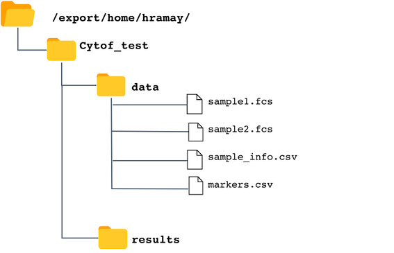

<br class="long"/>

# 1. Intorduction

The following CyTOF analysis pipeline called <b>cytoMine</b> is developed by the  IMC bioinformatics platform and utilizes state-of-the art existing R packages and custom code. The goal of this pipeline is to provide a simple command line interface so users can process their FCS files, transform, visualize and cluster their mass cytometry data.

## Pipleline Structure

<br>

* Preprocessing

    + Normalization
    + Debarcoding
    + Randomize 0 values between -1 and 0
    + Transformations


<br>

* Visualization
    + Basic plots for cell counts per sample, density plots for markers and PCA
    + Plot markers for inspection
    + t-SNE
    + t-SNE with different marker expressions

<br>

* Cell Clustering - automated

    + FlowSOM
    + ClusterX

<br>

* Cluster Merging based on expert input

* Discovery

    + Biomarker discovery :Differential cluster analysis and marker analysis. (Automatic implementation is  for two conditions only. For more complicated comparison, please contact our bioinformatician)
      
<br>

# 2. Prerequisites
You must know how to load files on the Snyder server and basic UNIX commands to be able to run this pipeline. If you are new to UNIX, please take a basic online course on shell or unix commands. One recommendation is dataCamp's introduction to shell for data science, https://www.datacamp.com/courses/introduction-to-shell-for-data-science. Doing first two chapters from this course is enough to run the pipeline.


<br class="long"/>


# 3. Where are your CYTOF files on the server?
Once an experiment has finished, the CyTOF files are transferred to the Snyder server (Snyder.chgi.ucalgary.ca). Files are in:
<b> /export/data/rawdata/npmcCytof/[PI'sname]/[YourName]/[Date]/ </b>

You can access them through programs like Filezilla by sftp. Please make sure that you have logged into VPN before connecting to the server.

<br class="long"/>

# 4: How to transfer files to Snyder
If you have modified fcs files by gating on them, you will need to transfer them back to the server for processing.
Similar to how files are transferred from the server to your computer, you can transfer file back to your home directory <b> (/home/[username])</b> and into a specified folder/directory for being processed by cytoMine. 

<br class="long"/>

# 5: Input directory and required files

Please first make a project folder. Then in this folder create a folder which has all the .fcs files and all other required .csv files. In this tutorial 'data' is used as the input directory.

For example take a look at figure 1. In my home directory /export/home/hramay I have created a directory Cytof_test and in this directory I have created a data directory which contains all input files. Input directory name is a required parameter of the pipeline and feel free to chose any name for it.

<br>



<br>
<br>

## Required InputFiles
All required inputFiles mentioned bellow should be in the inputDir. Default name for each file is provided. \textcolor{BrickRed}{Please use these files as templates and make sure column names are same.}


Filename | Description
---------|------------------------------------------
<a href="https://wcmcbioinformatics.github.io/CyTOF/examples/sample_info.csv">sample_info.csv</a>| This file holds information about your filenames, grouping, type etc.
<a href="https://wcmcbioinformatics.github.io/CyTOF/examples/marker_list.csv">marker_list.csv</a>| This file holds information about the markers of interest.

\textcolor{BrickRed}{Note: Please avoid spaces in your fcs file names. Feel free to use '\_' instead of space.}

<br class="long"/>
<br class="long"/>

# 6. Output files
All output files will be stored in the specified output directory. Directory name is a required parameter of the pipeline. In the above directory structure, results is the output folder.

<br class="long"/>
<br class="long"/>

# 7. Usage

All commands in this pipeline can be run on the Snyder console. Each command is structured in the following way:

```
COMMAND ( COMPULSARY Input parameters) [OPTIONAL Input parameters]}
```

\newpage 
All input parameters that are compulsory are shown inside the parentheses and optional inputs to a command are shown in square brackets. By typing the following command you can get help about the available options

```
cytoMine --help
```

<br>
<br>
<br>
<br>
<br>


```
Usage:
cytoMine (--inputDir=<files>  --outputDir=<results_dir> --mode=<mode>) [--transformMethod=<methodName>  --barcodeScheme=<barcodeScheme> --beadMasses=<beads> 
--FlowSom_k=<ClusterN> --downSample=<number> --perplexity=<p>  --theta=<theta> --max_iter=<max_iter> 
--num_threads=<num_threads> --sampleFile=<csvfile> --markerFile=<csvfile> --reclustFSFile=<csvfile> 
--reclustCXFile=<csvfile>]

Options:
--inputDir=<files>              Input FCS files direcotry
--outputDir=<dir>               Output directory for data and plots
--mode=<mode>                   [defualt full] modes available: basic, concat, channels or full
--beadMasses=<beads>		        Bead masses to be used for normalization (optional)
--barcodeScheme=<filename>	    filename for the barcode scheme for debarcoding (optional)
--transformMethod=<transform>   [default logicl] options:autoLgcl,none,arcsinh,cytofAsinh
--FlowSom_k=<N of clusters>     Number of clusters to calculate with FLOWSOM
--downSample=<number of cells>  [default 5000] or set your own numnber
--perplexity=<p>                [default 30 ] Perplexity parameter
--theta=<theta>                 [default 0.5 ] Speed/accuracy trade-off (increase for less accuracy),
                                set to 0.0 for exact TSNE (default: 0.5)
--max_iter=<max_iter>           [default 1000] Number of iterations
--num_threads=<num_threads>     [default 2] Number of cores to be used for parallel runs.
--sampleFile=<csvfile>          [default Sample_info.csv in inputDir] else any filename in inputDir.
--markerFile=<csvfile>          [default marker_list.csv in inputDir] else any filename in inputDir.
--reclustFSFile=<csvfile>       [default merge_FlowSom.csv in inputDir] else any filename in inputDir. 
                                This file is used to merge clusters generated by FlowSOM using user
                                provided merge list
--reclustCXFile=<csvfile>       [default merge_clusterx.csv in inputDir] else any filename in inputDir.
                                This file is used to merge clusters generated by ClusterX using user
                                provided merge list
```

<br>

# 8. Run cytoMine

Depending on the parts of the pipeline that you wish to run, you can chose the optional arguments and modes. The simplest command is as follows:

```
cytoMine  --inputDir=<directory> --outputDir=<directory> --mode=<mode>
```

There are different modes of the pipeline that can be run and are explained bellow:

<br>

# 9. Modes

cytoMine is developed so users can do different level of pipeline executions and do not have to wait for the full pipeline to run if they just wanted some very basic plots to understand their data. For this purpose, cytoMine has four working modes

<br> 
<br> 

## --mode=channels

In this mode, a user can find out how the channels are named/described in their fcs files. This is important because the marker list that the user input must match the names given in the description parameter of the fcs file.

<br> 

*An example of how to run this mode is:*

```
cytoMine  --inputDir=data --outputDir=results --mode=channels

```

A Channels.csv file is stored in the outputDir for quick look.

<br> 
<br> 

## --mode=concat

In this mode, a user can concatenate multiples files in to one. The resulting fcs file will be stored in the output folder. You can then re-run these samples along with others in the mode full or basic by adding them to the sample_info.csv file and placing them into the input folder.

<br> 

*An example of how to run this mode is:*

```
cytoMine  --inputDir=data --outputDir=results --mode=concat

```

<br> 
<br> 

## --mode=basic

In the basic mode, only the very basic plots are generated to give the user idea about their data.

<br> 

*An example of how to run this mode is:*

```
cytoMine  --inputDir=data --outputDir=results --mode=basic

```

The output is saved in the basicPlots folder in outputDir.

<br> 

Filename | Description
---------|------------------------------------------
counts_plot.png| barplots of cell counts in each sample file
density_plot.png| Density plots for each marker in the marker list for each sample
PCA_plot.png| PCA plots for samples


<br> 
<br> 

## --mode=full

In this mode the whole cytoMine pipeline is executed. All the results are saved in the outputDir folder or appropriate subfolders. All the data is also stored in an R object called cytoMine.RDATA. This is used if the user wants to re-run the code for expert annotated re-clustering/merging of the data.

```
cytoMine  --inputDir=data --outputDir=results --mode=full

```

<br> 
<br> 

## --mode=mergeClusters

This mode is used only after the cytoMine pipeline has been executed in the full mode first. This mode is used to re-assign or merge clusters generated by FLOWSOM or ClusterX.

<br> 

*An example of invoking mergeCluster mode with FlowSOM merging of clusters*

```
cytoMine  --inputDir=data --outputDir=results --mode=mergeCluster --reclustFSFile=merge_cluster.csv

```

An example of the merge_cluster.csv is [here](https://wcmcbioinformatics.github.io/CyTOF/examples/merge_cluster.csv). Please make sure that the column names are exactly the same.


<br class="long"/>

# 10. Use Cases

Follow are some of the use cases of the pipeline:

<br> 

## i. Find out correct Channel descriptions

It is pivotal that channel descriptions are used in your markers.csv file not the marker names. If they do not match, you will get an error as follows:

<br> 

```
"CytoMine: ** Error** Marker list does not match fcs file description.
 Please take a look at the 'desc' column in  Channels.csv file in results directory."
```
 
 <b>Please take a look at the Channels.csv file and make sure that markers in the markers.csv match the desc column of the Channels.csv file.</b>

<br> 

## ii. Run pipeline to get basic plots to know your data.

```
cytoMine  --inputDir=data --outputDir=results --mode=basic

```

<br> 

## iii. Run full pipeline with normlization and debarcoding

If you wish to use raw fcs files that are not normalized or debarcoded, you can use cytoMine to do so as follows:


```
cytoMine  ./analysis.R --inputDir=data --outputDir=results --mode=full --beadMasses=103,105,106
--barcodeScheme=bc.txt
```

--beadMasses parameter takes a list of bead masses for normalization and --barcodeScheme parameter takes a file as input which contains the barcode scheme. An example of this file is [bc.txt](https://wcmcbioinformatics.github.io/CyTOF/examples/bc.txt). You can normalize and debarcode separately also.

An optional parameter for normalization is norm_to which is a flowFrame or name of an FCS file from which baseline values should be computed and to which the input data should be normalized.

<br> 

## iv. Run full pipeline without normlizing or debarcoding

```
cytoMine  ./analysis.R --inputDir=data --outputDir=results --mode=full 
```

<br> 

## v. Concatenate files before running the pipeline

If you wish to concatenate fcs files, you can set up --concat option to true. This will save the resulting file in the outputDiR
```
cytoMine  ./analysis.R --inputDir=data --outputDir=results --mode=concat 
```

<br> 

## vi. Merge assigned clusters by automated algorithms based on expert cluster annotations

For FlowSOM clusters:

```
cytoMine  --inputDir=data --outputDir=results --mode=mergeCluster --reclustFSFile=merge_cluster.csv

```

<br>

For ClusterX clusters:

```
cytoMine  --inputDir=data --outputDir=results --mode=mergeCluster --reclustCXFile=merge_cluster.csv

```

An example of the merge_cluster.csv is [here](https://wcmcbioinformatics.github.io/CyTOF/examples/merge_cluster.csv). Please make sure that the column names are exactly the same.

<br>
<br>

# 11. Download data from the server
To transfer your output folder with all the results to your computer, please use Filezilla or other such programs to copy files.

# 12. Cautionary Notes

It is very important to spend time in planning your experiment. A good, thought through design will save you from having severe batch effects in your data that cannot be rectified later on by means of statistical methods. Please use barcoding where possible. If with barcoding, you have multiple runs, please include a control sample in each run so that it can be used later one to normalize all of the data. Also try to mix control and condition samples in each run.

If you run samples separately and on different days, you are bound to have severe batch effect. This means that the main difference in your samples will be the day effect. Here is an example of a PCA plot of such data. There are two conditions PKH and Saline with samples run on two different days and the main variability in this data is the day effect. One can avoid such situations by barcoding samples and introducing control samples in each run.


